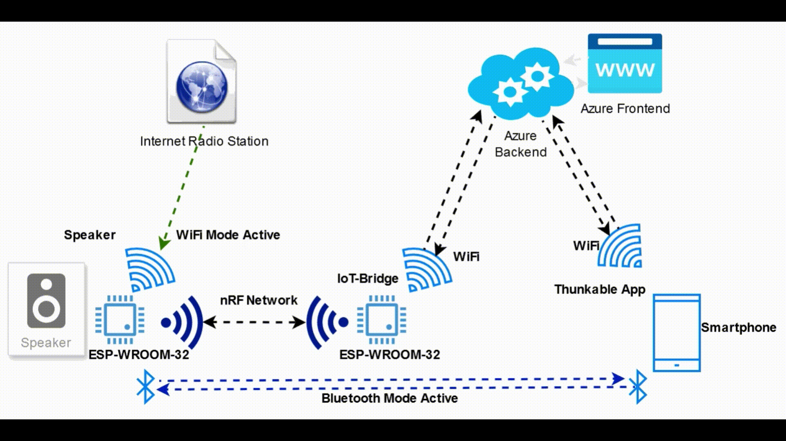

# Group 7 IoT Project: Wireless Stereo Speaker System
This one of the two github pages for Group 7s project for DTU course 34346 Networking technologies and application development for the Internet of Things (IoT).
## Group Members
- Andreas Nielsen: s203833
- Alexander Nordentoft: s176361
- Rasmus Kurdahl-Martinsen: s194337
- Sergio Piqueras Moreno: s232104
- Hugo Velasco Bombin: s233845
- Anton Per Rønnedal: s203821

## Project Description

The project is a wireless speaker system that can play music from a Bluetooth or WiFi source. The system consists of four main parts with subcomponents:

1. A speaker with an ESP32-WROOM-32 microcontroller.
   1. Two custom PCBs
      1. A power board with USB-C PD and a battery management system.
      2. An audio board with a class D amplifier, a DAC, ESP32-WROOM-32, and an nRF24L01 module.
      3. Rotary encoder for volume control and switching modes.
      4. OLED display for showing the current mode, metadata, battery level and volume.
2. ESP32 IoT Bridge
   1. An ESP32-WROOM-32 microcontroller.
   2. nRF24L01 module.
3. Azure Backend
    1. WebAPI for managing the speaker system.
    2. Simple front end for controlling the speaker system.
4. Thunkable App
    1. An app for controlling the speaker system using the Azure backend.

## Description of the Speaker System

*Code in BT_I2S_URL_OLED*

The speaker system consists of a speaker with an ESP32-WROOM-32 microcontroller. The speaker is powered by a custom power board with USB-C PD and a battery management system. The speaker can be powered by three 18650 batteries or by USB-C PD. The battery can be charged using USB-C PD.

The audio is played by a custom audio board with a class D amplifier.

The speaker can play music from a Bluetooth or WiFi source. The speaker can be controlled using the Thunkable app, the Azure backend or by using the rotary encoder and OLED display on the speaker.

When powering on the speaker, a byte will be read form the EEPROM to determine the mode of the speaker. The speaker can be in one of the following modes besides being powered off:
WiFi, Bluetooth, Standby or Charge

When powered on, a short press on the rotary encoder will switch betweent the current active mode to the valid passive mode, e.g. if the speaker is in WiFi mode and charging, a short press will switch to Charge mode. A short press again will switch back to WiFi mode. If the device is not charging, the speaker will go into Standby mode instead. From Standby mode, a long press (10 seconds) will turn off the speaker.

In all modes except powered off, the speaker will show the battery level on the OLED display as well as the current mode. It will have an active nRF network to the IoT Bridge and will be able to receive and transmit payloads from the nRF network.

Once a second the speaker checks for any changes in local device parameters and if they are different from the last time the speaker will send a payload to the IoT Bridge with the new parameters. Should the speaker receive a payload from the IoT Bridge, it will parse the payload and act accordingly.

When in WiFi mode, the speaker will start by playing Radio BOB! bby default. The speaker will show the current song and Internet Radio station on the OLED display.

When in Bluetooth mode, the speaker will connect to the last connected Bluetooth device and that device will be able to play music on the speaker. The speaker will show the current song on the OLED display. When connected to a compatible device, the speaker will show the current song on the OLED display and turning the volume down to 0 sends a pause command to the device. Turning the volume up will send a play command to the device.

When in Standby mode, the speaker will not play music, but the ESP32 will still be running with the OLED display and the nRF network active.

When in Charge mode, the speaker will charge the battery and show the battery level on the OLED display.

## Description of the IoT Bridge

*Code in NRF_COM_HUB*

The IoT Bridge consists of an ESP32-WROOM-32 microcontroller and an nRF24L01 module. The IoT Bridge is connected to the Azure backend using WiFi. The IoT Bridge sends a request to the Azure backend 5 second to check for any changes in the data. If the data has changed, the IoT Bridge sends the new data to the speaker system. The IoT Bridge receives data from the speaker system and sends it to the Azure backend.

## Description of the Azure Backend

*Code in https://github.com/AndreasNielsen4000/azureradioapi]https://github.com/AndreasNielsen4000/azureradioapi*

The Azure backend consists of a WebAPI for managing the speaker system. The WebAPI is connected to the IoT Bridge using WiFi. The WebAPI receives data from the IoT Bridge and sends data to the IoT Bridge. The WebAPI has a simple front end for controlling the speaker system.

## Description of the Thunkable App

The Thunkable app is an app for controlling the speaker system using the Azure backend. The app can be used to change the mode of the speaker system, search for new Internet Radio stations, change Internet Radio station and change the volume.

## Overview of Communication

## Video Preview of Functionality

https://github.com/AndreasNielsen4000/Group-7-IoT-Project/assets/8758884/1d90d405-0698-4473-90d2-c6516d68bdfd
