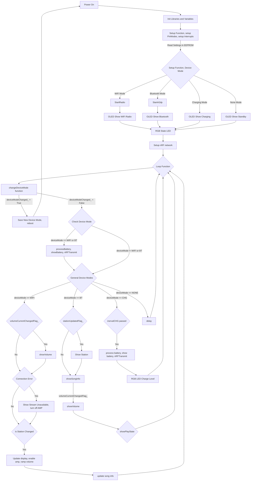
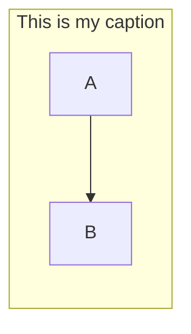
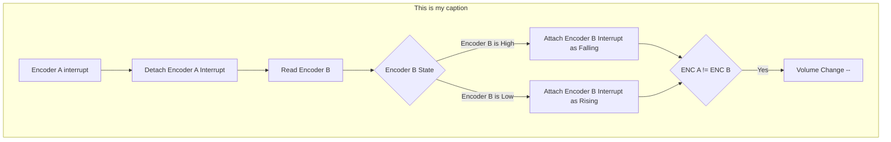
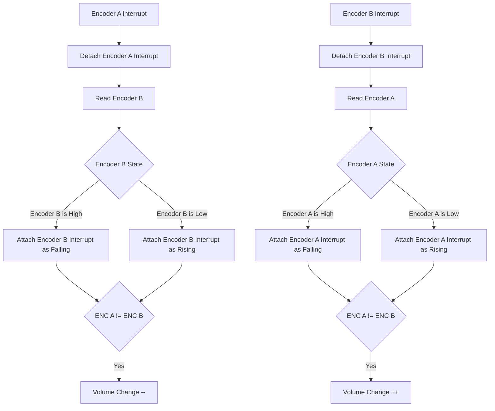
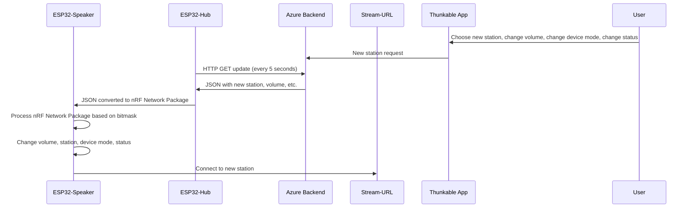

```mermaid
graph TD
    A[Power On] --> B[Init Libraries and Variables]

    B --> C[Setup Function, setup PinModes, setup Interrupts]
    C --> |Read Settings in EEPROM| D{Setup Function, Device Mode}
    D --> |WiFi Mode| E1[StartRadio]

    D --> |Bluetooth Mode| E2[StartA2dp]

    D --> |Charging Mode| H1[OLED Show Charging]

    D --> |None Mode| H2[OLED Show Standby]

    E1 --> F1[OLED Show WiFi Radio]

    E2 --> F2[OLED Show Bluetooth]

    F1 --> G[RGB State LED]

    F2 --> G
    H1 --> G
    H2 --> G

    G --> I[Setup nRF network]

    I --> J2{Loop Function}

    J2 -->  K[changeDeviceMode function]
    K --> |deviceModeChanged_ = True| J1[Save New Device Mode, reboot]
    J1 --> A
    K --> |deviceModeChanged_ = False| M{Check Device Mode}
    M --> |deviceMode == WIFI or BT| N[processBattery, showBattery, nRFTransmit]
    N --> O{General Device Modes}
    M --> |deviceMode != WIFI or BT| O

    O --> |deviceMode == WIFI| P1{volumeCurrentChangedFlag_}
    P1 --> |Yes| Q1[showVolume]
    P1 --> |No| R1{Connection Error}
    Q1 --> R1
    R1 --> |Yes| S1[Show Stream Unavailable, turn off AMP]
    R1 --> |No| T1{is Station Changed}
    S1 --> T1
    T1 --> |Yes| U1[Update display, enable amp, ramp volume]
    U1 --> V1[update song info]
    V1 --> J2

    O --> |deviceMode == BT| P2{stationUpdatedFlag_}
    P2 --> |Yes| Q2[Show Station]
    P2 --> |No| R2[showSongInfo]
    Q2 --> R2
    R2 --> |volumeCurrentChangedFlag_| S2[showVolume]
    S2 --> T2{showPlayState}
    T2 --> J2

    O --> |deviceMode == CHG| P3{inervalCHG passed}
    P3 --> |Yes| Q3[process battery, show battery, nRFTransmit]
    Q3 --> R3[RGB LED Charge Level]
    R3 --> J2

    O --> |deviceMode == NONE| P4[delay]
    P4 --> J2
```

```mermaid
graph LR
  subgraph This is my caption
    A --> B
  end
```

```mermaid
graph TD
subgraph This is my caption
    A1[Encoder A interrupt] --> B1[Detach Encoder A Interrupt]
    B1 --> C1[Read Encoder B]
    C1 --> D1{Encoder B State}
    D1 --> |Encoder B is High| E1[Attach Encoder B Interrupt as Falling]
    D1 --> |Encoder B is Low| F1[Attach Encoder B Interrupt as Rising]

    E1 --> G1{ENC A != ENC B}
    F1 --> G1
    G1 --> |Yes| H1[Volume Change --]
end
```

```mermaid
graph TD
A1[Encoder A interrupt] --> B1[Detach Encoder A Interrupt]
B1 --> C1[Read Encoder B]
C1 --> D1{Encoder B State}
D1 --> |Encoder B is High| E1[Attach Encoder B Interrupt as Falling]
D1 --> |Encoder B is Low| F1[Attach Encoder B Interrupt as Rising]

E1 --> G1{ENC A != ENC B}
F1 --> G1
G1 --> |Yes| H1[Volume Change --]


A2[Encoder B interrupt] --> B2[Detach Encoder B Interrupt]
B2 --> C2[Read Encoder A]
C2 --> D2{Encoder A State}
D2 --> |Encoder A is High| E2[Attach Encoder A Interrupt as Falling]
D2 --> |Encoder A is Low| F2[Attach Encoder A Interrupt as Rising]

E2 --> G2{ENC A != ENC B}
F2 --> G2
G2 --> |Yes| H2[Volume Change ++]
```

```mermaid
sequenceDiagram
    participant ESP32-Speaker
    participant ESP32-Hub
    participant Azure Backend
    participant Stream-URL
    participant Thunkable App
    participant User
    User->>Thunkable App: Choose new station, change volume, change device mode, change status
    Thunkable App->>Azure Backend: New station request
    ESP32-Hub->>Azure Backend: HTTP GET update (every 5 seconds)
    Azure Backend->>ESP32-Hub: JSON with new station, volume, etc.
    ESP32-Hub->>ESP32-Speaker: JSON converted to nRF Network Package
    ESP32-Speaker->>ESP32-Speaker: Process nRF Network Package based on bitmask
    ESP32-Speaker->>ESP32-Speaker: Change volume, station, device mode, status
    ESP32-Speaker->>Stream-URL: Connect to new station
```